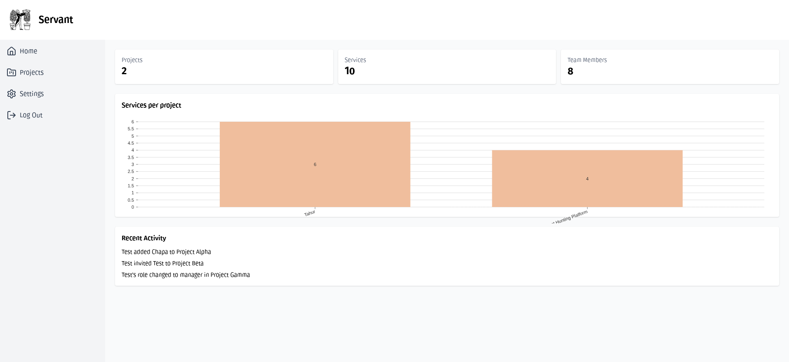
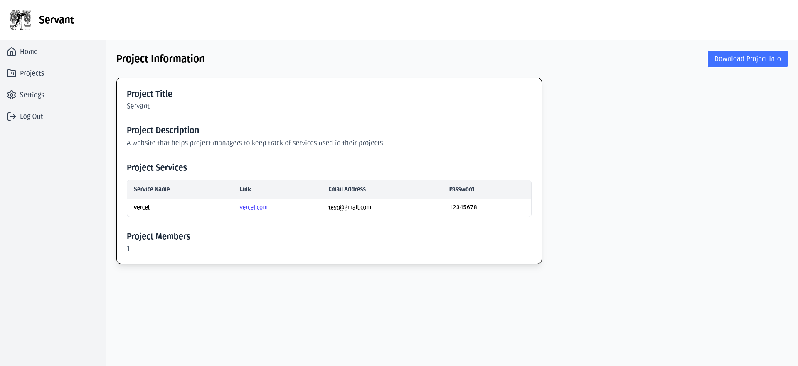
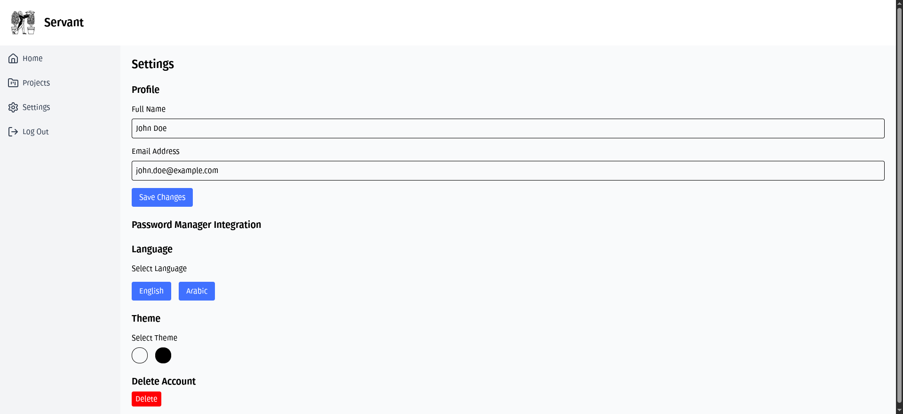

# Servant

**Servant** is a smart system designed to help users manage the third-party services used across different projects they are working on. By centralizing service tracking and project management, it ensures that all projects remain organized, transparent, and easy to maintain.

Servant will be built using **React**, **Django**, and **MySQL**, providing a reliable and scalable solution for managing services, projects, and team workflows efficiently.

Live website (React only): https://servant-gamma.vercel.app/

Note: Do not enter sensitive information on the live React demo, as it stores data in local storage and is not secure. For real projects, please use the full-stack version that will be released in the future.

## Screenshots

### Home Page

### Projects List

### Project Info

### Settings
